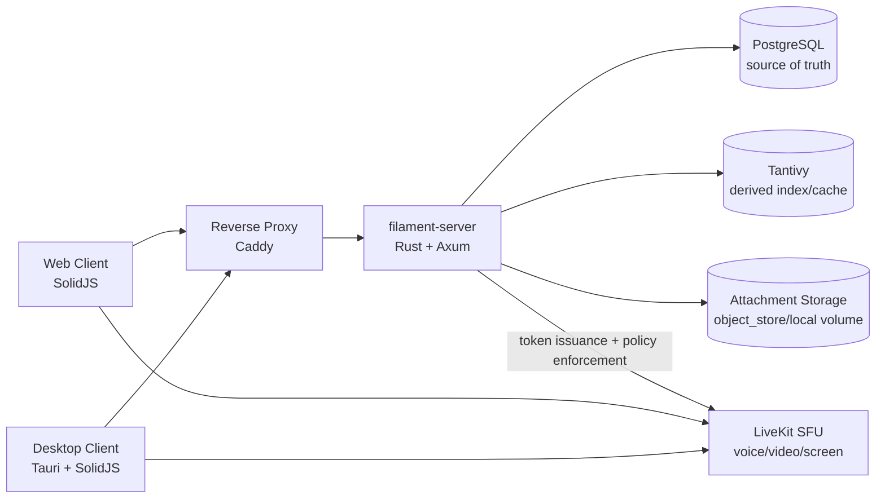

[](https://www.codefactor.io/repository/github/poisson-fish/filament)

# Filament

Filament is a security-first, self-hosted Discord-like platform for realtime chat, voice, video, and screen sharing.

It is built around a hardened Rust backend (`filament-server`), PostgreSQL as source-of-truth, Tantivy as a rebuildable search index, and LiveKit as the SFU for media transport.

## At a Glance

- Security-first architecture with strict request/message limits and rate limiting
- Realtime text over WebSocket gateway plus REST API for CRUD/search/admin flows
- Voice/video/screen share via server-issued, scoped LiveKit tokens
- End-to-end encryption roadmap built on MLS (RFC 9420) via OpenMLS for DMs, group DMs, guild encrypted channels, and calls ([`PLAN_E2EE.md`](PLAN_E2EE.md))
- Self-hostable with Docker Compose baseline
- Web and desktop clients (mobile planned)

## Current Status

Implementation is actively tracked in `PLAN.md`.

- Completed through Phase 8 (server, auth, gateway, attachments, search, roles/moderation, LiveKit integration, desktop hardening, deployment/ops baseline)
- Phase 9 (mobile) is planned
- End-to-end encryption is in design lock (Phase 0 of [`PLAN_E2EE.md`](PLAN_E2EE.md)); implementation is staged from identity/devices through DM and group E2EE, encrypted attachments/history, E2EE calls, guild encrypted channels, hardening, and key transparency

## Architecture


```mermaid
flowchart LR
  web[Web Client<br/>SolidJS]
  desktop[Desktop Client<br/>Tauri + SolidJS]
  caddy[Reverse Proxy<br/>Caddy]
  server[filament-server<br/>Rust + Axum]
  postgres[(PostgreSQL<br/>source of truth)]
  tantivy[(Tantivy<br/>derived index/cache)]
  attachments[(Attachment Storage<br/>object_store/local volume)]
  livekit[LiveKit SFU<br/>voice/video/screen]

  web --> caddy
  desktop --> caddy
  caddy --> server
  server --> postgres
  server --> tantivy
  server --> attachments
  server -->|token issuance + policy enforcement| livekit
  web --> livekit
  desktop --> livekit
```

Design principles:

- Untrusted-input model at every network boundary (client and server)
- Hostile-operator model for E2EE conversations (roadmap): the server stores and orders opaque ciphertext only, and every security-relevant fact is verified cryptographically client-side
- Domain invariants and validated DTO-to-domain conversion
- Bounded queues, payload caps, rate limits, and timeouts by default
- Search index treated as cache, never as sole source of truth

## Core Features

- Authentication and sessions:
  - Argon2id password hashing
  - PASETO access tokens + rotating refresh tokens
  - Anti-enumeration friendly auth behavior
- Realtime messaging:
  - Versioned gateway envelope (`{ v, t, d }`)
  - Guilds, channels, message history, pagination, reactions
- Content safety:
  - Markdown to safe token model (no HTML embed/render path)
  - Link sanitization and strict parsing
- Attachments:
  - Size limits, MIME sniffing, quota enforcement, secure storage paths
- Moderation and authorization:
  - Roles/permissions model, membership controls, audit-oriented operations
- Search:
  - Tantivy-backed query with bounded complexity and result caps
  - Rebuild/reconcile flows from Postgres
- Media:
  - Channel kinds: `text` and `voice` (`voice` is the RTC-capable channel kind)
  - LiveKit integration for voice/video/screen share
  - Short-lived, scoped, permission-limited media tokens
  - Explicit RTC UX states and troubleshooting for reconnect, permission denial, and token/session expiry

## End-to-End Encryption (Roadmap)

Filament is adopting a single MLS (RFC 9420) stack via OpenMLS for end-to-end encrypted DMs, group DMs, opt-in guild encrypted channels, and calls. The design is hardened against a hostile server operator with full database read and archive capability, and is tracked in [`PLAN_E2EE.md`](PLAN_E2EE.md).

Today, conversations are protected in transit (TLS) and readable by the server at rest — which is what enables server-side search and moderation. The E2EE roadmap changes that model for encrypted conversations:

- One protocol stack: 1:1 DMs as 2-member MLS groups, group DMs and guild `encrypted` channels as MLS groups, and calls via SFrame keyed from MLS exporter secrets
- Forward secrecy and post-compromise security by default — a retained ciphertext archive is worthless, and a one-time key theft stops working after the next update commit
- Member-signed membership: the server can never add readers or devices; server-initiated moderation is cryptographically limited to removals
- No key escrow: a conversation is E2EE or honestly plaintext — there is no server-readable "encrypted" middle mode
- Mailbox retention: the server holds E2EE ciphertext only until delivery (or TTL); local encrypted stores are canonical history, with device-to-device sync and opt-in passphrase-encrypted backup
- Trust from verification: encryption indicators derive from local cryptographic checks, never from server-supplied fields

Tradeoffs, stated plainly: E2EE participation requires signed packaged desktop/mobile builds (web clients are excluded in v1), and server-side content search and silent content scanning are unavailable in encrypted contexts by design — replaced by client-side local search and member-visible moderation. Workspaces that need server-side archives or moderation simply keep channels plaintext.

Security contracts for E2EE are folded into [`docs/SECURITY.md`](docs/SECURITY.md) and [`docs/THREAT_MODEL.md`](docs/THREAT_MODEL.md).

## Technology Stack

| Area | Technologies |
|---|---|
| Server | Rust, Tokio, Axum, Tower |
| Auth | Argon2id, PASETO, refresh-token rotation |
| Database | PostgreSQL + `sqlx` |
| Search | Tantivy (derived index) |
| Media | LiveKit SFU |
| E2EE (planned) | MLS (RFC 9420) via OpenMLS, SFrame media encryption, SQLCipher-encrypted local history |
| Clients | SolidJS web, Tauri + SolidJS desktop |
| Infra | Docker Compose, Caddy |
| Security/Quality | `cargo audit`, `cargo deny`, clippy, tests, SBOM |

## Project Structure

- `apps/filament-server`: Rust API + gateway + auth + search + attachment metadata
- `apps/filament-client-web`: SolidJS web client
- `apps/filament-client-desktop`: Tauri + SolidJS desktop client
- `crates/`: shared Rust crates (`filament-core`, `filament-protocol`, etc.)
- `infra/`: Docker Compose, ingress config, backup/restore scripts, observability assets
- `docs/`: API, protocol, security, threat model, deployment guides

## Documentation

- Plan and roadmap: [`PLAN.md`](PLAN.md)
- E2EE design and rollout plan: [`PLAN_E2EE.md`](PLAN_E2EE.md)
- API reference: [`docs/API.md`](docs/API.md)
- Gateway protocol: [`docs/PROTOCOL.md`](docs/PROTOCOL.md)
- Security model and controls: [`docs/SECURITY.md`](docs/SECURITY.md)
- Threat model: [`docs/THREAT_MODEL.md`](docs/THREAT_MODEL.md)
- Client hardening: [`docs/CLIENT_SECURITY.md`](docs/CLIENT_SECURITY.md)
- Deployment and operations: [`docs/DEPLOY.md`](docs/DEPLOY.md)

## Run with Docker Compose

Prerequisites:

- Docker Engine (or Docker Desktop)
- Docker Compose v2 (`docker compose`)

From the repository root:

```bash
cp infra/.env.example infra/.env
# edit infra/.env for LAN IP or domain settings
docker compose --env-file infra/.env -f infra/docker-compose.yml up -d --build
```

This starts:

- `postgres`
- `livekit`
- `filament-server`
- `reverse-proxy` (Caddy)
- Optional: `filament-web` (disabled by default; enable with `--profile web`)

Default local endpoints (from `infra/.env.example`):

- Filament API/Gateway (via proxy): `http://localhost:8080`
- Health check: `http://localhost:8080/health`
- LiveKit signaling: `ws://localhost:7880`
- Metrics endpoint: `http://localhost:8080/metrics`

Useful commands:

```bash
# View service status
docker compose --env-file infra/.env -f infra/docker-compose.yml ps

# View logs
docker compose --env-file infra/.env -f infra/docker-compose.yml logs -f filament-server

# Check health quickly
curl -fsS http://localhost:8080/health

# Stop services
docker compose --env-file infra/.env -f infra/docker-compose.yml down

# Stop and remove volumes (destructive: deletes local data)
docker compose --env-file infra/.env -f infra/docker-compose.yml down -v
```

Optional bundled web container:

```bash
# in infra/.env
# CADDY_WEB_UPSTREAM=filament-web:4173
docker compose --profile web --env-file infra/.env -f infra/docker-compose.yml up -d --build
```

Vite dev server knobs (`apps/filament-client-web`, loaded from `infra/.env`):

- `VITE_DEV_ALLOWED_HOSTS` (comma-separated)
- `VITE_DEV_API_PROXY_TARGET`
- `VITE_DEV_GATEWAY_PROXY_TARGET`
- `VITE_DEV_HMR_CLIENT_PORT`
- `VITE_FILAMENT_HCAPTCHA_SITE_KEY`

## Local Quality Checks

```bash
cargo fmt --all
cargo clippy --workspace --all-targets --all-features
cargo test --workspace
```
